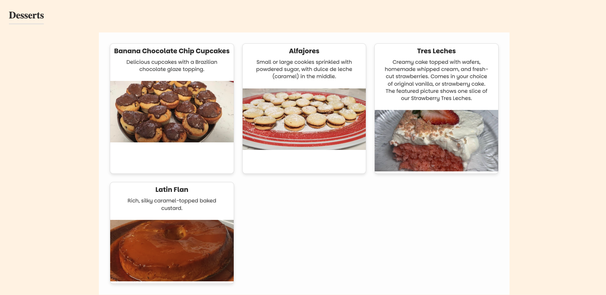

# Nessa's Kitchen
   ## Description:
   This deployed application was built using React, Typescript, and CSS. The user can view this website using laptops, computers, Ipads, tablets, and phones. The purpose of this project was to advertise my mom's business as a caterer. The viewer can read about the business owner on the landing page, click on links to contact her and view the social media pages. On the other navigation tabs, the user can view the entire menu, and fill out a working contact form to email her.
   ## Table of Contents:
   * [Installation](#installation)
   * [Usage](#usage)
   * [License](#license)
   * [Contributing](#contributing)
   * [Tests](#tests)
   * [Questions](#questions)
   ## Installation:
   After cloning this repository, run the command in your terminal "npm i " to install the dependencies that are in the package.json file. Run in the command line "npm run start" to begin working with the application.
   ## Usage:
   Viewing the header, you can navigate between the tabs to view the home page, menu, and contact form. The icon links will take you to the social media page, business email, or initiate a phone call.

   Here is the link to the deployed application:
https://nessaskitchen.netlify.app/
   
   

   ## License: 
   
   [Click to read more!](https://opensource.org/licenses/MIT)
   ## Contributing: 
   * Create a feature branch using "git checkout -b *branchname*" in your terminal. 
   * After making your changes, type in the command "git commit -m "*detailed message on added features*".
   * Push changes to your feature branch using "git push origin *branchname*". 
   * Finally, create a pull request on Github for those changes to be merged. 

Contributions are appreciated😊!
   ## Tests:
   N/A
   ## Questions:
   * Github: [Link to profile](https://github.com/victoriamata)
   * Email: victoriamataxo@gmail.com
   
